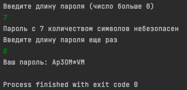

<p align="center">

</p>

# **Password Generator**

## Description
The program implements generation of a password of a user-specified length <br>
Password complexity is determined by the following parameters:
- length should be more or equal then 8 characters;<br>
- must contain one or more uppercase characters;<br>
- must contain one or more lowercase characters;<br>
- must contain one or more digits;<br>
- must contain one or more other special symbols (*_-);<br>

## Run program
````
javac Main.java
java Main
````
## Example
<p align="center">

</p>